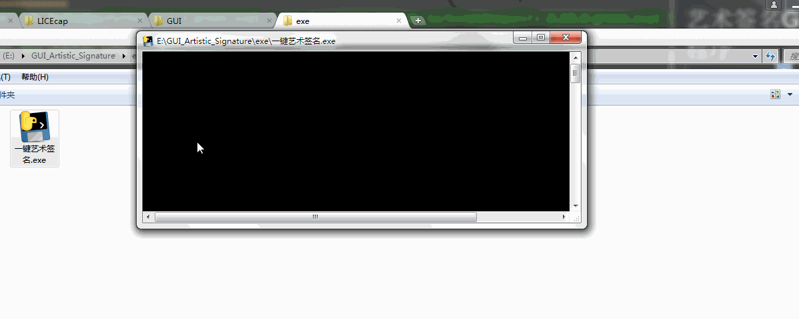

艺术签名GUI桌面程序 
===========================
  
### 艺术签名官网 - http://www.yishuzi.com/
|Author|:sunglasses:Henryhaohao:sunglasses:|
|---|---
|Email|:hearts:1073064953@qq.com:hearts:

    
****
## :dolphin:声明
### 软件仅用于学习交流，请勿用于任何商业用途！感谢大家！
## :dolphin:介绍
### 该项目为[艺术签名](http://www.yishuzi.com/)的GUI桌面程序。采用Python3自带的Tkinter库。
 - 项目目录:
    - Tkinter GUI程序: Spiders/GUI_Artistic_Signature.py
    - exe运行程序: exe/一键艺术签名.exe (使用pyinstaller库将python文件打包成可执行的exe程序)
 - 以下是软件运行截图:

## :dolphin:运行环境
Version: Python3
## :dolphin:安装依赖库
```
pip3 install -r requirements.txt
```